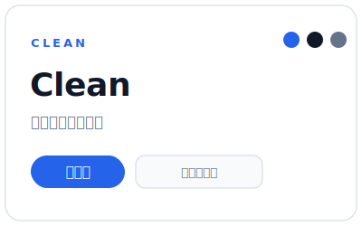
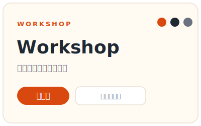
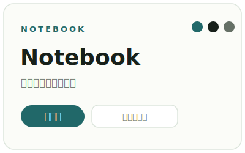
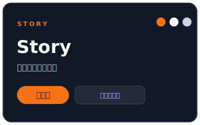
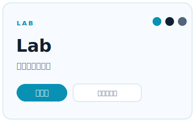
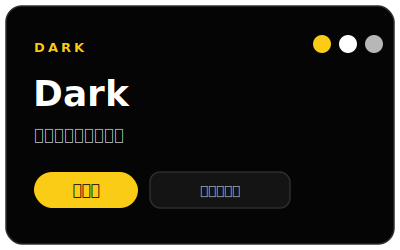

# html-slides

一個 [Claude Code](https://claude.com/claude-code) 的 skill，讓你用講的就能做出**漂亮、好維護的 HTML 簡報**。

你只要在 Claude Code 裡描述想做什麼，它會先跟你討論一份「逐頁重點」的草案，確認方向後，再幫你生成一個可以直接打開的HTML簡報。


## 這個 skill 適合誰？

- 想快速把一堂課、一場研習、一份報告變成投影片的老師與講者。
- 不想碰 PowerPoint 排版、也不想學投影片工具的人。
- 想做「有活動、有互動」的教學簡報，而不只是把講稿貼成一頁頁條列。

做出來的成品是**一個 `.html` 檔**：用瀏覽器（Chrome、Safari、Edge）點兩下就能全螢幕播放，而且還可以手動去改（如果你懂HTML的話？）

## 它能幫你做什麼

- **從零開始做簡報**：給它主題、受眾、想講多久，它幫你規劃頁面、寫重點、生成簡報。
- **把現成內容變簡報**：丟給它一份大綱、逐字稿或筆記，它幫你拆成一頁一頁。
- **改版既有簡報**：把舊的 HTML 簡報交給它，請它換風格、補活動、調順序。
- **準備教學活動**：自動套用「先讓學生試 → 再揭示範例 → 比較 → 修正」的節奏。
- **加上講者備註**：每頁可以藏一段只有你看得到的提示。
- **發布到網路**：需要的話，幫你整理成可以放上 GitHub Pages 的形式。

## 特色

- **草案先行**：先給你一份逐頁重點的草案讓你確認，再生成 HTML——方向不對時，改草案比改整份簡報省事得多。
- **6 種風格**：Clean（預設）、Workshop、Notebook、Story、Lab、Dark，一句話就能整份換風格。
- **22 種版型**：12 種通用 + 10 種教學版型，涵蓋封面、數據、流程、比較、活動、反思等常見頁面。
- **教學導向**：內建活動版型（情境／任務／時間／產出／討論），很適合工作坊與課堂。
- **完成前自我驗收**：交付前會逐頁交代核心訊息、逐條對照成功標準，把判斷攤開讓你一眼核對，而不是只說一句「做好了」。
- **無障礙友善**

## 風格預覽

六種風格共用同一套設計規則，差別主要在背景、文字與強調色的氣質。

<table>
  <tr>
    <td align="center"><br><b>Clean</b>（預設）</td>
    <td align="center"><br><b>Workshop</b></td>
    <td align="center"><br><b>Notebook</b></td>
  </tr>
  <tr>
    <td align="center"><br><b>Story</b></td>
    <td align="center"><br><b>Lab</b></td>
    <td align="center"><br><b>Dark</b></td>
  </tr>
</table>

## 安裝

把整個資料夾放到 Claude Code 的 skills 目錄就好：

**個人全域**（所有專案都能用）：

```bash
git clone https://github.com/gatelynch/html-slides.git ~/.claude/skills/html-slides
```

**只給單一專案用**：

```bash
git clone https://github.com/gatelynch/html-slides.git <你的專案>/.claude/skills/html-slides
```

裝好後，在 Claude Code 裡提到「做簡報 / HTML 簡報 / slide deck」就會自動啟動這個 skill。

如果都看不懂也沒關係，先點右上角的 Code，再點 Download Zip，下載後請 Claude Code幫你安裝就好

## 怎麼用

直接用講的，把需求告訴 Claude：

> 幫我做一份介紹班級 AI 使用規範的教學簡報，Workshop 風格，大約 15 頁，需要講者備註。

接下來會經過四個階段：

1. **問清楚**：Claude 會先確認目的、受眾、時間長度、風格、要不要講者備註等。已經講過的就不會再問。
2. **給草案**：先產出一份 **markdown 草案**，逐頁列出「這頁用哪種版型、標題是什麼、重點有哪些」。你可以在這裡盡情增刪頁面、調整順序、改重點。
3. **生成簡報**：你滿意草案後，才會生成真正的 `.html` 檔。
4. **自我驗收**：完成前它會逐頁列出標題與核心訊息、逐條對照成功標準（一頁一重點、不依賴捲動、風格與版型一致等），把判斷攤開讓你快速核對，最後回報檔案位置與怎麼打開。

> 💡 趕時間、需求很單純時，也可以直接說「不用草案，直接出 HTML」，它就會跳過第 2 步。

## 更多使用範例

只要把情境、風格、頁數、有沒有特別需求講出來就好。以下是各種場景的說法：

**教學 / 工作坊**

> 做一份「AI輔助課程設計」的研習簡報，要有讓老師先自己寫、再看範例的活動，20 分鐘，Workshop 風格。

**一般報告 / 產品說明**

> 幫我把這份專案進度整理成 10 頁簡報，要有時間軸和三個關鍵數字，Clean 風格，正式一點。

**故事型演講**

> 我想講一個「學生從討厭寫作到願意投稿」的故事，照片我自己放，少字、有畫面感。請你先給我一些選項讓我選

**技術 / AI 教學**

> 做一份教老師用 AI 改作文的簡報，要有 prompt 範例和「改一個條件看差異」的實驗頁，Lab 風格。

**把現成內容變簡報**

> 這是我的演講逐字稿（貼上內容），幫我拆成簡報，一頁一個重點，最後給我講者備註。

**改版既有簡報**

> 這份 deck.html 太多條列了，幫我換成 Notebook 風格，並把第 3～5 頁改成一個討論活動。

**發布到網路**

> 簡報做好了，幫我放上 GitHub Pages 。

## 6 種風格怎麼選

| 風格 | 氣質 | 適合場合 |
|---|---|---|
| **Clean**（預設） | 安靜、精準、可掃讀 | 研習、課程講義、產品說明、報告，大多數簡報 |
| **Workshop** | 明確、可操作、有節奏 | 工作坊、實作課、分組討論 |
| **Notebook** | 沉穩、留白、有註記感 | 知識梳理、閱讀導讀、反思活動 |
| **Story** | 敘事、沉浸、少字 | 故事型演講、課堂案例、前後轉變 |
| **Lab** | 界面感、實驗感 | 技術教學、AI prompt、工具比較 |
| **Dark** | 集中、俐落、戲劇性 | 舞台、錄影、強情緒開場、技術 demo |

沒指定的話，預設用 **Clean**。一份簡報只挑一種主風格，整份才會一致。

## 22 種版型一覽

「版型」就是每一頁的長相。Claude 會依內容自動挑選，你也可以指定。

### 通用版型（12 種）

| 版型 | 用途 |
|---|---|
| **Cover** | 開場標題頁：放主題與一句承諾 |
| **Agenda** | 議程／路徑：讓觀眾知道接下來會走到哪 |
| **Two-column** | 左右兩欄：一邊說明、一邊放圖或證據 |
| **Stat** | 大數字：用 1～3 個數字建立重量感 |
| **Feature Grid** | 卡片網格：整理能力、觀點或模組 |
| **Comparison** | 比較表：用共同標準比較兩個選項 |
| **Process** | 流程：呈現 3～5 個步驟 |
| **Timeline** | 時間軸：里程碑、課程節奏、進度 |
| **Chart** | 圖表：用長條／折線等支撐定量論點 |
| **Code** | 程式碼／指令／prompt 片段 |
| **Quote** | 引言：用一句話建立觀點或情緒 |
| **Closing** | 收尾：一句收束語與下一步 |

### 教學版型（10 種）

| 版型 | 用途 |
|---|---|
| **Activity** | 完整活動頁：情境、任務、時間、產出、討論問題 |
| **Try First** | 先讓學生自己試，不先給答案 |
| **Reveal** | 嘗試後揭示範例或教師版本，並說明為什麼有效 |
| **Prompt Lab** | 針對 prompt／AI 工具的實驗頁（目標、變因、觀察點） |
| **Compare Tools** | 比較不同工具、模型或方法 |
| **Rubric** | 評分規準／品質階梯，可拿來給回饋 |
| **Classroom Case** | 真實或擬真的課堂案例（角色、衝突、決策點） |
| **Reflection** | 反思頁：收斂學習者的觀察與下一步 |
| **Workflow** | 教一套可重複操作的流程 |
| **Before/After** | 呈現修改前後的差異與改動理由 |

## 播放時的小技巧

簡報打開後：

- **換頁**：鍵盤左右鍵（或上下鍵）翻頁，空白鍵前進。
- **切換捲動方式**：預設是傳統的「左右翻頁」；按 **V** 可切換成「上下捲動」（像滑網頁）。也可以在網址後面加 `?layout=vertical` 直接用上下捲動打開。
- **講者備註**：每頁的提示存在 `data-note` 裡，依你的需求決定要不要顯示。
- **離線播放**：沒有網路也能放，只要圖片跟著 `.html` 一起帶著走。

## 內容結構

```text
html-slides/
├── SKILL.md                      # skill 主檔（流程與原則）
├── references/
│   ├── outline-format.md         # 草案 markdown 格式
│   ├── deck-patterns.md          # 通用版型
│   ├── teaching-patterns.md      # 教學版型
│   ├── style-system.md           # 風格與 CSS token
│   ├── github-pages.md           # 發布到 GitHub Pages
│   └── qa-checklist.md           # 交付前檢查清單
└── assets/
    ├── templates/
    │   └── base-deck.html        # 基礎簡報模板
    └── preview/                  # README 風格預覽圖（6 種風格）
        ├── clean.svg
        ├── workshop.svg
        ├── notebook.svg
        ├── story.svg
        ├── lab.svg
        └── dark.svg
```
